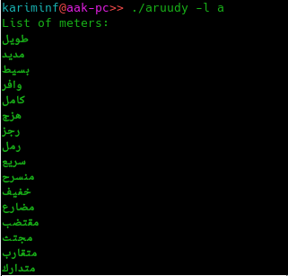
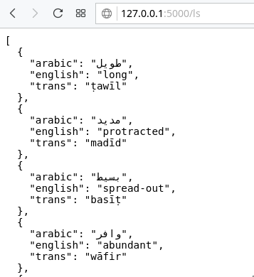
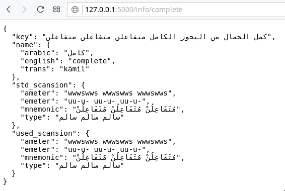
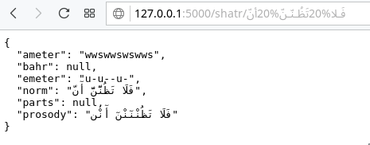

# Aruudy

[](https://kariminf.github.io/aruudy/)
[](http://www.apache.org/licenses/LICENSE-2.0)
[](https://pypi.python.org/pypi/aruudy)
[](https://pypi.org/project/aruudy/)
[](https://pypi.org/project/aruudy/)
[](https://travis-ci.org/kariminf/aruudy)
[](https://codecov.io/gh/kariminf/aruudy)
[](https://www.codefactor.io/repository/github/kariminf/aruudy/overview/master)
[](https://codebeat.co/projects/github-com-kariminf-aruudy-master)
[](https://codeclimate.com/github/kariminf/aruudy/)

Aruudy is a light library for Arabic prosody (Aruud) or "Science of Poetry".

[Test here](https://kariminf.github.io/aruudy/)

[web API: kariminf.pythonanywhere.com/](https://kariminf.pythonanywhere.com/)

## Features

- bahr
    - Recover all meters (arabic name, english name, transliterated name)
    - Get the meters information by either its arabic or english names


- poetry
    - Information about Arabic poetery meters
    - Normalizing part (shatr) of a verse: delete tatweel, add forgotten diacretics
    - Writing the part into prosody form
    - Finding the arabic prosodic units "watad" and "sabab" based on haraka (vowel)
    - Finding the english prosodic units based on syllables
    - Detecting Arabic poetry meter


- web
    - API with flask
    - CGI (Common Gateway Interface) program


## Use

### Install

```
pip install aruudy
```

### Command line

#### List all available meters

```sh
aruudy [-l | --list] [a|e|t]
```
Will print the 16 meters names in
- Arabic if the option is "a"
- English if the option is "e"
- Transliteration if the option is "t"

For example:

```sh
aruudy -l a
```



#### Get information about a meter

```sh
aruudy [-i, --info] <name>
```

The name can be in Arabic or in English.

Example:

```sh
aruudy -i long
```


#### Get the meter of a Shatr (part of verse)

```sh
aruudy [-s, --shatr] <text>
```

Example:

```sh
aruudy -s "أَسِرْبَ القَطا هَلْ مَنْ يُعِيْرُ جَناحَهُ"
```


### Web Api

The api uses **flask** which must be installed. To launch the server on your machine (locally), type:

```sh
python aruudy/web/api.py
```

This will create a server on **http://127.0.0.1:5000**.

The api has three request types:

#### $host/ls

Returns a json object with names of available Arabic poetry meters (16 meters).
The object has three lists:
- arabic: Arabic names of the 16 meters
- english: English equivalent names
- trans: transliterated names



#### $host/info/< name >

Retrieve information about a meter by its name (arabic or english).
It returns a json object describing the meter (bahr).
- aname: Arabic name of the meter
- ename: English name of the meter
- trans: transliterated name
- ameter: the meter used by Arabs as defined by Al-Khalil
- emeter: the meter by syllables (European method)
- key: a verse which describs the bahr




#### $host/shatr/< text >

Used to find the meter of the given text (a shatr: part of the verse). It returns a json object with these information:
- text: the original text
- norm: the text normalized: no tatweel, fix some diacretics
- prosody: prosody writing (الكتابة العروضية) of the text
- ameter: the arabic meter of the text
- emeter: the english/european meter of the text
- bahr: the name of the bahr
    - if not found, it is a string "None"
    - if found, it is a json object with "aname", "ename" and "trans"





### Programming

Arabic poetry meter detection

```python
#!/usr/bin/env python
# -*- coding: utf-8 -*-

from aruudy.poetry import meter

text = u'أَسِرْبَ القَطا هَلْ مَنْ يُعِيْرُ جَناحَهُ'

shatr = meter.process_shatr(text)

#original text
print("original: " + shatr.orig)

#Normalized text
print("normalized: " + shatr.norm)

#prosody form
print("prosody form: " + shatr.prosody)

# Farahidi meter for poetry
print("arabic scansion: " + shatr.ameter)

# Western-like metre
print("western scansion: " + shatr.emeter)

#get the bahr: it has aname, ename, trans,
b = shatr.bahr

# Bahr arabic name
print("western scansion: " + b.aname)

```

You can process a text with sub-functions (without using **meter.process_shatr** which uses them all):
- **meter.normalize(text)**: returns a normalized text; deletes tatweel and fix some diacretics problems
- **meter.prosody_form(text)**: returns the prosody writing (الكتابة العروضية) of the text
- **meter.get_ameter(text)**: returns a string of arabic meter  with "v" as haraka "c" as sukuun
- **meter.get_emeter(ameter)**: returns european meter from a given arabic meter

## Recommendations

To detect the meter, the poem's part must be fully vocalized (has diacritics).
To this end, It is recommended to use [Mishkal](https://github.com/linuxscout/mishkal)

@TODO more examples

## License
Copyright (C) 2014-2019 Abdelkrime Aries

Licensed under the Apache License, Version 2.0 (the "License");
you may not use this file except in compliance with the License.
You may obtain a copy of the License at

[http://www.apache.org/licenses/LICENSE-2.0](http://www.apache.org/licenses/LICENSE-2.0)

Unless required by applicable law or agreed to in writing, software
distributed under the License is distributed on an "AS IS" BASIS,
WITHOUT WARRANTIES OR CONDITIONS OF ANY KIND, either express or implied.
See the License for the specific language governing permissions and
limitations under the License.
